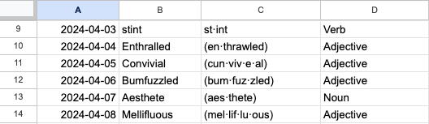
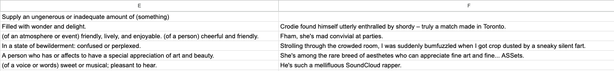
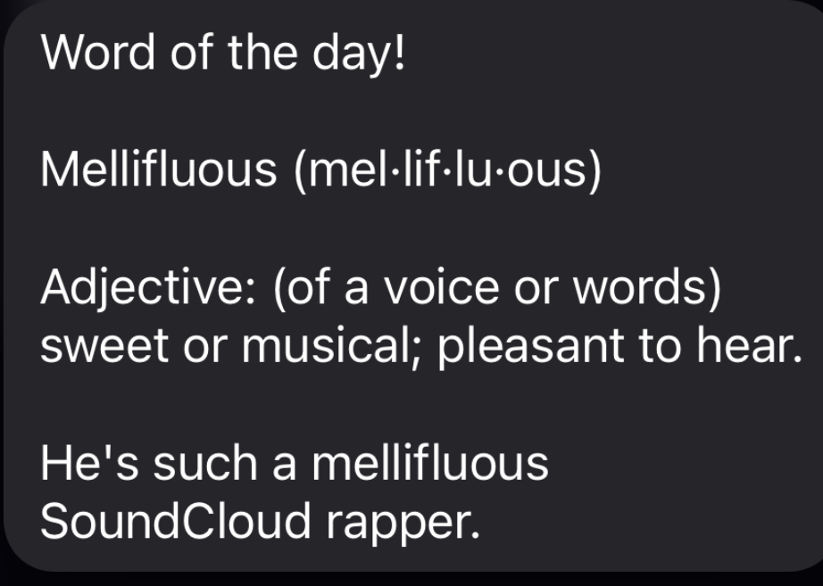

# textbot

Welcome to the Word of the day text bot that I created to show my friends new words to improve their vocabulary!

In this repo you will see two scripts:
- SendWord.py --> this is the main script that sends out the word, definition and sentence to every user who signed up.
- WordFromExcel.py --> This script gets all the information from a google sheet, loaded with all the information.
    For example this is what some of the google sheet entries look like: 

Phone numbers are recorded via Google form and stored in a google sheet, which is refered to in the main script. 

The final text looks like this:

